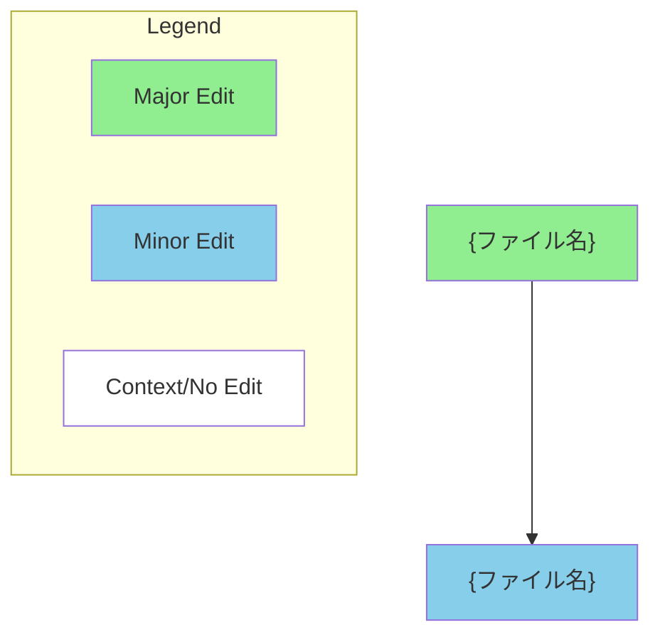

## 目的
GitHub Pull Request の description を、定義済みテンプレートに基づいて  
**一貫した形式で自動生成**する。

---

## Preconditions / Assumptions
- GitHub CLI (`gh`) が利用可能
- PR の diff / commit 情報を参照可能であるか与えられる

---

## Inputs
- `PR_NUMBER` (string | int)

### Optional Inputs
- 対象の diff / コミットハッシュ

---

## Outputs
- 対象 PR の description が以下を満たす形式で更新される
  - 変更概要（Summary）
  - 主な変更点
  - 実装内容
  - 動作確認項目
  - レビュアー向けチェックリスト
  - （必要に応じて）Mermaid Diagram
---

## PR Description Template (Canonical)

```markdown
# {変更内容のタイトル}

## Summary
{変更の背景と概要を簡潔に記載}

**主な変更点:**
- {変更点1}
- {変更点2}
- {変更点3}

## チケットへのリンク
{URL または「ここはまだない」}

## やったこと
- {実装内容}
- {修正内容}
- {テスト追加・変更}

## 動作確認
- [ ] {確認項目1}
- [ ] {確認項目2}
- [ ] {確認項目3}

## レビュー & 動作確認 チェックリスト
- [ ] **{重要項目1}** - {説明}
- [ ] **{重要項目2}** - {説明}
- [ ] **{重要項目3}** - {説明}

**推奨テスト計画:**
1. {手順1}
2. {手順2}
3. {手順3}

## その他気になることや相談ごと
{特になければ空欄}

---

### Diagram (Optional)


Notes
{特記事項やコメント}
Requested by: {依頼者の情報} (@{GitHubユーザー名})

## 実行手順

### 1. PR情報の取得
```bash
# PRの詳細を確認
gh pr view {PR_NUMBER} --repo your/repository
```

### 2. 変更内容の分析

```bash
# 変更されたファイルを確認
gh pr diff {PR_NUMBER} --repo your/repository

# コミット履歴を確認
gh pr view {PR_NUMBER} --repo your/repository --json commits
```

### 3. Description更新
#### PRのdescriptionを更新（ファイル経由）
```bash
echo "上記テンプレートの内容" > pr_description.md
gh pr edit {PR_NUMBER} --repo your/repository --body-file pr_description.md
```
### テンプレート記入ガイド

#### 必須項目
- タイトル: 変更内容を端的に表現
- Summary: 変更の背景と概要
- 主な変更点: 具体的な変更内容をリスト化
- やったこと: 実装した内容を詳細に記載
- 動作確認: 確認すべき項目をチェックリスト形式で

#### 推奨項目
- Review & Testing Checklist: レビュアー向けの重要確認項目
- 推奨テスト計画: 具体的なテスト手順
- Diagram: 変更の影響範囲を視覚化（mermaid形式）

#### 省略可能項目
- チケットへのリンク: 関連issueがない場合は「ここはまだない」
- その他気になることや相談ごと: 特になければ空欄でも可

#### 注意事項
- GitHub Copilotコードレビューへの指示コメントは自動で含まれる
- 依頼者情報は正確なGitHubユーザー名を記載する
- mermaidダイアグラムは変更の複雑さに応じて調整する

# 使用例
PR #123の場合：

```
# PR情報取得
gh pr view 123 --repo your/repository

# テンプレート適用
# {PR_NUMBER} → 123
# {変更内容のタイトル} → 利用者応対メモ更新API実装
# 各セクションを実際の内容で記入

# Description更新
gh pr edit 123 --repo your/repository --body-file updated_description.md
```
