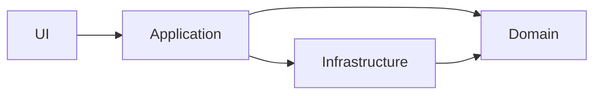

# Architecture Dependency Skill

## 目的
- モジュール間・パッケージ間・レイヤ間の**依存関係を可視化**し、アーキテクト視点で**望ましい依存の形**に導くための判断材料を出す。
- 変更容易性、理解容易性、テスト容易性、デプロイ容易性、チーム開発の衝突削減を目的に、**依存の整理方針・ルール・移行手順**を提示する。

## このスキルが提供するもの
- 現状の依存関係の整理（依存マップ、循環、境界違反、凝集度/結合度の評価）
- アーキテクチャ方針（レイヤリング、境界、依存方向、例外ルール）
- 改善計画（段階的移行ステップ、リスク、検証、DoD）
- レビュー観点と運用ルール
- **視覚的な出力（mermaid / tree / TUI）による理解補助**

## このスキルが提供しないもの
- 具体的なコード修正案（差分、パッチ、置換指示、実装例）
- 行単位・構文単位の実装指示

## 絶対ルール（ガードレール）
- 出力に **コード変更（修正版コード / diff / パッチ / 置換指示）を含めない**。
- 擬似コードも出さず、責務・境界・依存方向を文章と図で示す。

---

## 出力フォーマット

### 1. 結論サマリ
- 依存関係の問題点と改善の方向性を簡潔にまとめる。

### 2. 視覚ブロック（必須）

#### A) Mermaid: 依存グラフ


#### B) Mermaid: レイヤ構造
```mermaid
graph TD
  subgraph Presentation
    UI
  end
  subgraph Application
    Application
  end
  subgraph Domain
    Domain
  end
  subgraph Infrastructure
    Infrastructure
  end

  UI --> Application
  Application --> Domain
  Application --> Infrastructure
  Infrastructure --> Domain
```

#### C) Tree: ディレクトリ / パッケージ構成
```text
.
├─ cmd/              # エントリポイント
├─ internal/
│  ├─ presentation/ # UI / API
│  ├─ application/  # ユースケース
│  ├─ domain/       # ドメインモデル
│  └─ infra/        # DB / 外部I/O
└─ pkg/              # 共有（最小限）
```

#### D) TUI: 依存マトリクス
```text
Dependency Matrix (row -> col)

          UI  App  Domain  Infra
UI         -   X     -      -
App        -   -     X      X
Domain     -   -     -      -
Infra      -   -     X      -
```

---

## 3. 現状分析（As-Is）
- 循環依存
- 境界違反
- 神モジュール
- 横断関心の散在

## 4. あるべき依存原則（To-Be）
- 循環依存を禁止
- 内側（Domain）は外側（Infra）に依存しない
- 境界を跨ぐのは契約（API / DTO / Event）のみ

## 5. 移行計画（Small Steps）
- 戻せる単位で段階的に整理
- 各ステップで目的・影響・検証を明示

## 6. 完了条件（DoD）
- 循環依存ゼロ
- 禁止依存が明文化されている
- モジュール責務が説明可能

## 7. レビュー観点
- 境界を越えた依存が増えていないか
- Shared が肥大化していないか
- 依存追加に理由があるか（ADR）
