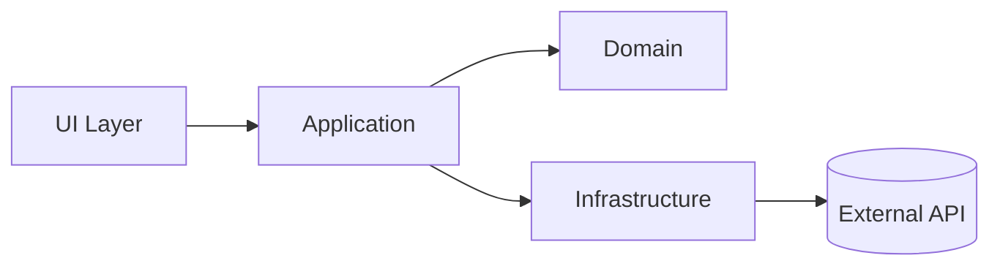
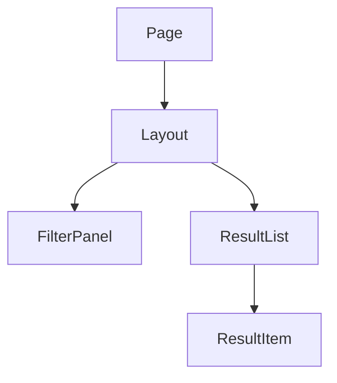

# Format Rich HTML Diagram

## 目的

開発者が `index.html` をブラウザで開くだけで、コードや設計の全体像、階層、関係、流れ、状態の変化を理解できるリッチな可視化資料を作る。
必要に応じて SVG、Canvas、WebGL、2D / 3D 表現、アニメーションを使い、静的な文章では伝わりにくい空間構造や時間変化を表現する。

このスキルは出力形式を定義する。コード変更そのものではなく、理解、整理、説明、レビュー、設計検討のための HTML 成果物を作る。

## 出力契約

- 成果物は原則 `index.html` 1 ファイルにまとめる。
- ユーザーが保存やコピーをしなくても、同じワークスペース内の `index.html` を開けば閲覧できる状態にする。
- npm install、依存追加、ビルド手順、プロジェクト設定変更は行わない。
- 外部ライブラリを使う場合は CDN で読み込む。
- セキュリティ観点から、このスキルに列挙した CDN ライブラリと許可済み Google Fonts 以外は使わない。
- CSS と小さな JavaScript は `index.html` 内にインラインで含める。
- リッチな表現が不要な箇所まで重くしない。静的な表やリストで十分な情報は静的にする。
- SVG、Mermaid、Canvas、WebGL、HTML テーブル、カード、タブ、検索、フィルタ、2D / 3D ビュー、アニメーションを目的に応じて組み合わせる。

## CDN ライブラリ選定

必要なものだけ使う。すべてを同時に入れない。
セキュリティとレビュー容易性のため、外部ライブラリはこの表に列挙したものだけを使う。

| 用途 | 第一候補 | CDN 例 | 使う場面 |
|---|---|---|---|
| 手書き図、レイヤー図、独自アイコン、軽量な図解 | Inline SVG | CDN 不要 | アーキテクチャ概要、責務境界、凡例、注釈、独自レイアウト |
| フローチャート、シーケンス、状態遷移 | Mermaid | `https://cdn.jsdelivr.net/npm/mermaid@11/dist/mermaid.esm.min.mjs` | 処理フロー、データフロー、sequence diagram、state diagram、依存関係の簡易表現 |
| 階層ツリー、サンキー、カスタム SVG | D3.js | `https://cdn.jsdelivr.net/npm/d3@7/+esm` | ディレクトリ階層、React component tree、データ流量、独自レイアウト |
| ノード・エッジの依存グラフ | Cytoscape.js | `https://cdn.jsdelivr.net/npm/cytoscape@3/dist/cytoscape.esm.min.mjs` | モジュール依存、責務境界、サービス間関係、複雑なグラフ |
| 2D Canvas / WebGL 表現 | PixiJS | `https://cdn.jsdelivr.net/npm/pixijs@8/dist/pixi.min.js` | 大量ノード、レイヤー構造、粒子、座標付きマップ、滑らかな 2D 表現 |
| 3D 表現 | Three.js | import map で `three` を `https://cdn.jsdelivr.net/npm/three@0.173.0/build/three.module.js` に向ける | レイヤーを奥行きで見せる、3D dependency map、空間的なアーキテクチャ表現 |
| アニメーション | Anime.js | `https://cdn.jsdelivr.net/npm/animejs/dist/bundles/anime.umd.min.js` | 状態遷移、データ移動、処理ステップ、注目箇所の強調 |
| コードハイライト | Prism.js | `https://cdn.jsdelivr.net/npm/prismjs@1/components/prism-core.min.js` | 重要なコード断片、API 型、設定例を読みやすく見せる |
| Markdown 断片の描画 | marked | `https://cdn.jsdelivr.net/npm/marked@12/+esm` | 入力が Markdown 中心で、一部を HTML 内に変換したい場合 |
| SVG の pan / zoom | svg-pan-zoom | `https://cdn.jsdelivr.net/npm/svg-pan-zoom@3/dist/svg-pan-zoom.min.js` | 大きな SVG 図を拡大縮小したい場合 |

選定基準:

- 単純な独自図なら inline SVG を優先する。CDN 不要で、注釈、色、レイヤー、矢印、凡例を細かく制御できる。
- フローチャートやシーケンスのように構文で表せる図は Mermaid を優先する。読みやすく、HTML 内に図のソースも残せる。
- グラフが大きく、ノード選択やフィルタが必要なら Cytoscape.js を使う。
- 階層、ツリー、サンキー、独自の SVG 表現が必要なら D3.js を使う。
- 2D で大量要素、滑らかな移動、座標表現が必要なら PixiJS を使う。
- 3D が理解を助ける場合だけ Three.js を使う。奥行きが単なる装飾なら使わない。
- 時間変化や注目順序を伝えたい場合は Anime.js を使う。常時動く装飾ではなく、理解を助ける短いアニメーションにする。
- コード断片を載せる場合だけ Prism.js を使う。
- CDN が読み込めない環境を考慮し、重要な説明は図だけに閉じ込めず、隣に要約テキストや表を置く。
- 表にないライブラリ、許可済み以外のフォント、アイコン CDN、analytics、tracking、外部画像 CDN は使わない。必要に見えても、まず inline SVG、標準 HTML/CSS/JavaScript、または表にあるライブラリで代替する。
- 表にないライブラリをどうしても追加したい場合は、出力を作る前にユーザーへ確認し、用途、CDN URL、追加理由、セキュリティ上の影響を明示する。

## 許可済み Google Fonts

Google Fonts は次だけ使ってよい。

| 用途 | Font | 読み込み例 |
|---|---|---|
| 本文、見出し、UI ラベル | Noto Sans JP | `https://fonts.googleapis.com/css2?family=Noto+Sans+JP:wght@400;500;700&display=swap` |
| コード、型、ファイルパス | JetBrains Mono | `https://fonts.googleapis.com/css2?family=JetBrains+Mono:wght@400;500;700&display=swap` |

両方を使う場合は 1 つの stylesheet にまとめる。

```html
<link rel="preconnect" href="https://fonts.googleapis.com">
<link rel="preconnect" href="https://fonts.gstatic.com" crossorigin>
<link href="https://fonts.googleapis.com/css2?family=JetBrains+Mono:wght@400;500;700&family=Noto+Sans+JP:wght@400;500;700&display=swap" rel="stylesheet">
```

CSS では次を基本にする。

```css
body { font-family: "Noto Sans JP", system-ui, sans-serif; }
code, pre, .mono { font-family: "JetBrains Mono", ui-monospace, monospace; }
```

上記以外の Google Fonts を追加したい場合も、他の未列挙ライブラリと同じくユーザー確認を必須にする。

## HTML 構成

`index.html` は次の構成を基本にする。対象に存在しない章は省略してよい。

1. Header
   - タイトル
   - 対象リポジトリ、対象範囲、生成日時
   - 読み方の短い説明
2. Overview
   - 3-7 個の要点
   - 主要な登場概念
   - 変更や設計の目的
3. Architecture
   - レイヤー、境界、外部依存、主要モジュール
   - Mermaid graph または SVG 図
4. Structure
   - ディレクトリ階層、React component tree、module tree
   - 折りたたみ可能な tree view
5. Flow
   - データフロー、処理フロー、状態遷移、シーケンス
   - Mermaid sequence / flowchart / state diagram を使い分ける
6. State
   - 状態の所有者、更新契機、派生値、永続化先
   - React state、store、server state、URL state を分ける
7. Interactive View
   - 2D / 3D / アニメーションが理解を助ける場合だけ配置する
   - 再生、一時停止、リセット、視点変更、凡例を用意する
8. Contracts
   - API、型、イベント、props、入力、出力、エラー
   - 表と短いコード断片で示す
9. Risks / Open Questions
   - 不明点、設計リスク、検証不足、次に確認すべき点
10. Appendix
   - 調査したファイル、根拠、関連コマンド、補助メモ

## UI 要件

- 左側または上部にナビゲーションを置き、章へジャンプできるようにする。
- 重要な図は画面幅に収め、必要なら pan / zoom や横スクロールを付ける。
- 図と説明文を近くに置き、図だけを見ても本文だけを見ても理解できるようにする。
- ノード、レイヤー、状態、リスクには色を使う。ただし色だけで意味を表さず、ラベルや凡例も付ける。
- カードを多用しすぎず、図、表、短い説明、詳細パネルの役割を分ける。
- アニメーションを入れる場合は、再生、一時停止、リセットを用意する。
- 3D 表現を入れる場合は、視点の初期位置、凡例、操作説明、2D 代替説明を用意する。
- 2D / 3D canvas は固定サイズに閉じ込めず、親要素の幅に合わせて resize する。
- モバイル対応より、開発者がデスクトップブラウザで読む密度と見通しを優先する。
- テキストが図や UI に重ならないように、固定サイズではなく responsive な幅、折り返し、スクロールを使う。

## 図の使い分け

### アーキテクチャ

レイヤー、境界、依存方向を見せる。構文で十分なら Mermaid flowchart、独自レイアウトや注釈が必要なら inline SVG を使う。



### React コンポーネント構造

親子関係、責務、props、state の所有者を見せる。小規模なら Mermaid、大きい場合は D3 tree を使う。



### データフロー

入力、変換、保存、表示、外部 I/O を見せる。データの向きが重要なら Mermaid flowchart、量や分岐が重要なら D3 sankey を使う。

### 状態管理

状態の所有者、更新イベント、派生値、購読者を分ける。state diagram または表を併用する。

### シーケンス

ユーザー操作、UI、API、DB、外部サービスの時系列を見せる。Mermaid sequenceDiagram を使う。

### 処理フロー

分岐、エラー、リトライ、非同期処理を見せる。Mermaid flowchart を使い、例外系は通常系と色やレーンで分ける。

### Inline SVG

CDN なしで表現できる図解として積極的に使う。レイヤー図、境界線、矢印、注釈、凡例、番号付きステップ、簡単なアイコンを 1 つの `<svg>` にまとめる。大きい SVG には `viewBox` を設定し、必要なら `svg-pan-zoom` を併用する。

### 2D 表現

座標、密度、グルーピング、クラスタ、動くデータを見せる。D3 の SVG で足りるなら D3 を使い、要素数が多い、滑らかな移動が必要、Canvas / WebGL が適する場合は PixiJS を使う。

### 3D 表現

奥行きが意味を持つ場合に限って使う。例: レイヤーを z 軸で分ける、依存方向を空間で分ける、ランタイムとビルドタイムを別平面にする。Three.js を使う場合は、静的な 2D 要約も同じページに置く。

### アニメーション

理解順序を作るために使う。例: リクエストが UI から API、DB、外部サービスへ流れる、状態が `idle` から `loading`、`success` へ遷移する、イベントが複数 store に伝播する。ループし続ける装飾より、再生可能な短い説明アニメーションを優先する。

## 作成手順

1. 対象範囲、読者、知りたい問いを確認する。
2. 関連ファイル、型、関数、コンポーネント、データ構造、テストを読む。
3. 情報を「全体像」「階層」「流れ」「状態」「契約」「リスク」に分類する。
4. 各分類に合う図の形式と CDN ライブラリを選ぶ。
5. `index.html` を作成する。
6. ブラウザで開く前提で、ナビゲーション、図の表示、本文、表、リンク切れを確認する。
7. 使った CDN と、オフライン時に制限される表示を Appendix に書く。

## HTML 実装ルール

- `<!doctype html>` から始める完全な HTML にする。
- `<meta name="viewport" content="width=device-width, initial-scale=1">` を入れる。
- CDN script と Google Fonts は上記の許可リストから必要最小限にし、読み込み理由を HTML コメントまたは Appendix に残す。
- inline SVG は `viewBox`、`role="img"`、`aria-labelledby`、`title` / `desc` を入れ、意味が伝わるようにする。
- Mermaid を使う場合は `securityLevel: "strict"` を基本にする。
- Three.js を使う場合は `<script type="importmap">` と `<script type="module">` を使い、OrbitControls など addon が必要なら同じ import map で解決する。
- Canvas / WebGL を使う場合は、初期化失敗時に説明テキストを表示する fallback を用意する。
- アニメーションは `prefers-reduced-motion` を尊重し、該当環境では自動再生しない。
- ユーザー入力や未信頼テキストを HTML に埋める場合は escape する。
- 外部送信、analytics、tracking、許可済み Google Fonts 以外の外部フォントの読み込みは入れない。
- 図の元データは HTML 内の JavaScript object、Mermaid source、または `<script type="application/json">` として残す。
- ファイルパスやコード参照は、可能なら相対パスのテキストとして表示する。ブラウザで直接開いたときに壊れるリンクへ依存しない。

## 出力時の報告

最終報告では次を短く伝える。

- 作成した `index.html` のパス
- 含めた主な可視化
- 使用した CDN ライブラリ
- 確認した表示項目
- 残る制限や未確認点
