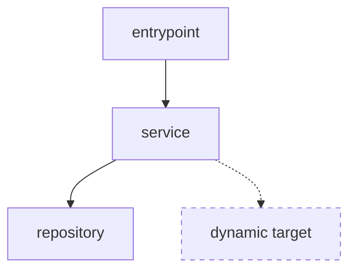

# Code Tracer

## 目的

特定のシンボル、関数、メソッド、型、モジュールについて、呼び出し経路を根拠付きで可視化する。

- どこから呼ばれているか（callers）と何を呼んでいるか（callees）を整理する。
- 静的に確定できる経路と、動的ディスパッチや DI などによる推定経路を分ける。
- 出力は Markdown と Mermaid を基本とし、必要に応じて dot / png などを使う。

## 入力

最低限、次を確認する。

- `symbol`: 対象シンボル、関数、メソッド、型、モジュール名。
- `direction`: `callers`、`callees`、`both` のいずれか。未指定なら `both`。
- `language`: 対象言語。既存ファイルや拡張子から推定できる場合はそれを使う。

任意で次を確認する。

- `depth`: 追跡深度。未指定なら `2`。
- `scope`: 調査対象のディレクトリ、パッケージ、モジュール。
- `format`: `markdown`、`mermaid`、`dot`、`png` など。未指定なら `markdown` + `mermaid`。
- `exclude`: テスト、生成コード、vendor、mock などの除外条件。

## 言語別リファレンス

対象言語が分かる場合は、必要な参照だけ読む。

- Go: `references/go.md`

該当するリファレンスがない場合は、言語サーバー、静的解析、参照検索、ビルドツール、既存 IDE 設定から使える根拠を選ぶ。

## 解析原則

- grep だけで呼び出し関係を断定しない。
- language server、AST、型情報、call hierarchy、references、callgraph など、より構造化された根拠を優先する。
- 動的ディスパッチ、reflection、DI、イベント、設定駆動の呼び出しは、確実な線と推定の線を分ける。
- 調査範囲、除外条件、使ったコマンド、根拠の限界を明記する。
- 大規模コードベースでは、まず scope と depth を狭めてから必要に応じて広げる。

## 手順

1. 対象シンボル、方向、深度、調査範囲、除外条件を決める。
2. 対象言語のリファレンスがあれば読み、利用できる解析手段を選ぶ。
3. 参照、call hierarchy、callgraph、関連定義を集める。
4. 確実な経路、推定経路、未確定の候補を分ける。
5. Markdown に要約、解析条件、呼び出し経路、Mermaid 図、根拠、限界をまとめる。

## Mermaid 表現

- 確実なエッジは実線で表す。
- 推定エッジは破線（`-.->`）で表す。
- ノード名は短くし、必要に応じて完全修飾名を本文に補足する。

## 出力

成果物には次を含める。

1. 対象、方向、深度、scope、除外条件。
2. 呼び出し経路の要約。
3. callers / callees のリスト。
4. Mermaid 図。
5. 確実 / 推定 / 未確定の区分。
6. 根拠として使ったコマンドやファイル。
7. 解析上の限界と追加調査候補。
