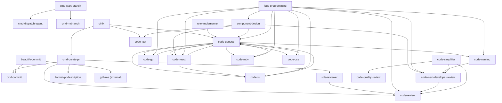

# Skill Dependency Map

このドキュメントは、internal skill 同士の明示的な依存関係を整理するためのマップです。

ここでの依存は、`SKILL.md` の本文や description に「併用する」「使う」「参照する」と明記されている関係を対象にします。似た目的を持つだけの関係や、エージェントロール上の暗黙の関係は含めません。

「この目的なら別 skill を優先する」という関係は、実行時の依存ではなくルーティングとして別に整理します。

## 全体図

```text
internal skills
├── workflow
│   ├── cmd-create-pr
│   │   ├── cmd-commit
│   │   ├── role-reviewer
│   │   ├── code-review
│   │   └── format-pr-description
│   ├── cmd-start-branch
│   │   ├── cmd-dispatch-agent
│   │   └── cmd-rmbranch
│   ├── beautify-commit
│   │   ├── cmd-commit
│   │   └── grill-me (external)
│   └── ci-fix
│       ├── code-general
│       ├── code-test
│       └── cmd-create-pr
├── role
│   ├── role-reviewer
│   │   └── code-review
│   └── role-implementer
│       └── code-general
└── code work
    ├── code-general
    │   ├── code-naming
    │   ├── code-go
    │   ├── code-ts
    │   ├── code-react
    │   ├── code-ruby
    │   └── code-css
    ├── language skills
    │   ├── code-go -> code-general
    │   ├── code-ts -> code-general
    │   ├── code-react -> code-general, code-ts
    │   ├── code-ruby -> code-general
    │   └── code-css -> code-general
    ├── component-design
    │   ├── code-general
    │   ├── code-react
    │   ├── code-test
    │   └── code-next-developer-review
    ├── lego-programming
    │   ├── code-general
    │   ├── code-go
    │   ├── code-ts
    │   ├── code-react
    │   ├── code-ruby
    │   ├── code-css
    │   ├── component-design
    │   ├── code-naming
    │   ├── code-review
    │   └── code-next-developer-review
    ├── code-naming
    │   └── code-next-developer-review
    ├── code-quality-review
    ├── code-next-developer-review
    │   └── code-review
    └── code-simplifier
        ├── code-quality-review
        ├── code-review
        └── code-next-developer-review
```

## ワークフロー系

| Skill | 依存先 | 関係 |
|---|---|---|
| `cmd-create-pr` | `cmd-commit` | 未コミット変更や High 指摘対応後の追加差分を commit するときに使う。 |
| `cmd-create-pr` | `role-reviewer` | PR 作成・更新前のレビューゲートとして使う。 |
| `cmd-create-pr` | `code-review` | PR 前レビューで必要に応じて併用する。 |
| `cmd-create-pr` | `format-pr-description` | PR description を作るときに使う。 |
| `cmd-start-branch` | `cmd-dispatch-agent` | 不要ブランチ整理を別 agent に投げるときに使う。 |
| `cmd-start-branch` | `cmd-rmbranch` | 不要ブランチ整理 agent の依頼内容として使う。 |
| `beautify-commit` | `cmd-commit` | 整理後の commit 作成で使う。 |
| `beautify-commit` | `grill-me` | 分割方針が曖昧なときに整理方針を詰めるため使う。 |
| `ci-fix` | `code-general` | CI 失敗の修正に実装変更が必要なときに使う。 |
| `ci-fix` | `code-test` | テスト追加、flake 対策、検証コマンド整理が必要なときに使う。 |
| `ci-fix` | `cmd-create-pr` | CI 修正を PR 作成や PR 更新まで反映するときに使う。 |

## ロール系

| Skill | 依存先 | 関係 |
|---|---|---|
| `role-reviewer` | `code-review` | Reviewer として検証するとき、通常レビュー観点も併せて参照する。 |
| `role-implementer` | `code-general` | Implementer として実装するときの基本方針として併用する。 |

## コード作業系

| Skill | 依存先 | 関係 |
|---|---|---|
| `code-general` | `code-naming` | 命名判断で迷う場合に併用する。 |
| `code-general` | `code-go` | Go 実装や Go テストで言語別ガイドを確認するときに使う。 |
| `code-general` | `code-ts` | TypeScript 実装や React の型設計で言語別ガイドを確認するときに使う。 |
| `code-general` | `code-react` | React 実装でフレームワーク別ガイドを確認するときに使う。 |
| `code-general` | `code-ruby` | Ruby / Rails 実装やテストで言語別ガイドを確認するときに使う。 |
| `code-general` | `code-css` | CSS 実装で言語別ガイドを確認するときに使う。 |
| `code-go` | `code-general` | Go 固有の実装ガイドを読む前に共通実装原則を確認するために使う。 |
| `code-ts` | `code-general` | TypeScript 固有の実装ガイドを読む前に共通実装原則を確認するために使う。 |
| `code-react` | `code-general` | React 固有の実装ガイドを読む前に共通実装原則を確認するために使う。 |
| `code-react` | `code-ts` | React 実装で TypeScript の型設計が必要な場合に `code-ts/references/lang.md` を読む。 |
| `code-ruby` | `code-general` | Ruby / Rails 固有の実装ガイドを読む前に共通実装原則を確認するために使う。 |
| `code-css` | `code-general` | CSS 固有の実装ガイドを読む前に共通実装原則を確認するために使う。 |
| `component-design` | `code-general` | UI 設計後に実装へ進む場合に併用する。 |
| `component-design` | `code-react` | React 実装へ進む場合に、実装時の責務分離や Atomic Design の補助観点を確認するため併用する。 |
| `component-design` | `code-test` | テスト設計やテスト追加で併用する。 |
| `component-design` | `code-next-developer-review` | 次の開発者の読みやすさを確認する場合に併用する。 |
| `lego-programming` | `code-general` | 実装作業で仕様、公開契約、既存構造、検証方法を確認するときに併用する。 |
| `lego-programming` | `code-go` | Go 固有の実装判断が必要な場合に併用する。 |
| `lego-programming` | `code-ts` | TypeScript 固有の実装判断が必要な場合に併用する。 |
| `lego-programming` | `code-react` | React 固有の実装判断が必要な場合に併用する。 |
| `lego-programming` | `code-ruby` | Ruby / Rails 固有の実装判断が必要な場合に併用する。 |
| `lego-programming` | `code-css` | CSS 固有の実装判断が必要な場合に併用する。 |
| `lego-programming` | `component-design` | React / Next.js / TypeScript UI の大きな分割で、先に画面構成やコンポーネント境界を整理するときに併用する。 |
| `lego-programming` | `code-naming` | 作成した部品の責務を表す名前で迷う場合に併用する。 |
| `lego-programming` | `code-review` | 実装済み差分をレビューする場合に、仕様違反や回帰リスクと部品境界の問題を分けて扱うため併用する。 |
| `lego-programming` | `code-next-developer-review` | 実装済み差分の境界が次の開発者に伝わるか確認したい場合に併用する。 |
| `code-naming` | `code-next-developer-review` | 次に開発する人の理解しやすさ全体を見る場合に併用する。 |
| `code-next-developer-review` | `code-review` | 欠陥や重大リスクを見つけた場合に通常レビュー観点として分ける。 |
| `code-simplifier` | `code-quality-review` | 品質レポートや quality gate の観点から改善候補を拾う。 |
| `code-simplifier` | `code-review` | 可読性、効率性、テスト容易性などのレビュー観点として使う。 |
| `code-simplifier` | `code-next-developer-review` | 保守性や次の開発者の理解しやすさの観点として使う。 |

## 優先・ルーティング関係

次の関係は、ある skill が別 skill を内部で使うという意味ではありません。ユーザーの目的に合わせて、どちらの skill を先に選ぶべきかを示します。

| 起点 | 優先先 | 条件 |
|---|---|---|
| `code-general` | `code-review` | レビューのみが目的の場合。 |
| `component-design` | `code-review` | 実装済み差分の欠陥レビューが目的の場合。 |
| `component-design` | `code-test` | テストケース設計だけが目的の場合。 |
| `code-naming` | `code-typo` | typo や spelling の検査だけが目的の場合。 |
| `code-naming` | `code-review` | バグ、仕様違反、セキュリティ、データ整合性のレビューが目的の場合。 |
| `code-naming` | `code-general` | 実装変更やリネーム作業まで行う場合。 |
| `code-quality-review` | `code-review` | 仕様違反、セキュリティ、データ破壊など即時欠陥の検出が主目的の場合。 |
| `code-quality-review` | `code-next-developer-review` | 次の開発者の迷いやすさが主目的の場合。 |
| `code-review` | `code-general` | 具体的なコード変更の実装方法を相談する場合。 |
| `code-review` | `code-quality-review` | 将来的な変更容易性やコード品質を重点的に見る場合。 |
| `code-react` | `component-design` | 画面構成、大きな JSX 分割、component tree、実装順序を先に整理する必要がある場合。 |

## Mermaid 図



## 更新ルール

skill を追加または更新したときに、他 skill を明示的に参照する文を増やした場合は、このドキュメントも更新します。

更新時は次を確認します。

- `SKILL.md` に `$skill-name`、`` `skill-name` ``、または plain text で依存先が書かれているか。
- 依存が「必ず使う」「必要に応じて併用」「優先・ルーティング」のどれに近いか。
- 優先・ルーティング関係を実行時依存としてツリー図や Mermaid 図に混ぜていないか。
- ツリー図、表、Mermaid 図のすべてに同じ関係が載っているか。
- 外部 skill への依存は `(external)` と明記しているか。
