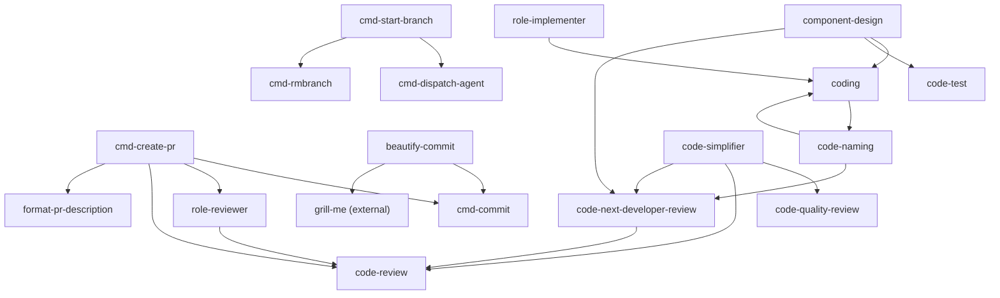

# Skill Dependency Map

このドキュメントは、internal skill 同士の明示的な依存関係を整理するためのマップです。

ここでの依存は、`SKILL.md` の本文や description に「併用する」「使う」「参照する」と明記されている関係を対象にします。似た目的を持つだけの関係や、エージェントロール上の暗黙の関係は含めません。

「この目的なら別 skill を優先する」という関係は、実行時の依存ではなくルーティングとして別に整理します。

## 全体図

```text
internal skills
├── workflow
│   ├── cmd-create-pr
│   │   ├── cmd-commit
│   │   ├── role-reviewer
│   │   ├── code-review
│   │   └── format-pr-description
│   ├── cmd-start-branch
│   │   ├── cmd-dispatch-agent
│   │   └── cmd-rmbranch
│   └── beautify-commit
│       ├── cmd-commit
│       └── grill-me (external)
├── role
│   ├── role-reviewer
│   │   └── code-review
│   └── role-implementer
│       └── coding
└── code work
    ├── coding
    │   └── code-naming
    ├── component-design
    │   ├── coding
    │   ├── code-test
    │   └── code-next-developer-review
    ├── code-naming
    │   ├── coding
    │   └── code-next-developer-review
    ├── code-quality-review
    ├── code-next-developer-review
    │   └── code-review
    └── code-simplifier
        ├── code-quality-review
        ├── code-review
        └── code-next-developer-review
```

## ワークフロー系

| Skill | 依存先 | 関係 |
|---|---|---|
| `cmd-create-pr` | `cmd-commit` | 未コミット変更や High 指摘対応後の追加差分を commit するときに使う。 |
| `cmd-create-pr` | `role-reviewer` | PR 作成・更新前のレビューゲートとして使う。 |
| `cmd-create-pr` | `code-review` | PR 前レビューで必要に応じて併用する。 |
| `cmd-create-pr` | `format-pr-description` | PR description を作るときに使う。 |
| `cmd-start-branch` | `cmd-dispatch-agent` | 不要ブランチ整理を別 agent に投げるときに使う。 |
| `cmd-start-branch` | `cmd-rmbranch` | 不要ブランチ整理 agent の依頼内容として使う。 |
| `beautify-commit` | `cmd-commit` | 整理後の commit 作成で使う。 |
| `beautify-commit` | `grill-me` | 分割方針が曖昧なときに整理方針を詰めるため使う。 |

## ロール系

| Skill | 依存先 | 関係 |
|---|---|---|
| `role-reviewer` | `code-review` | Reviewer として検証するとき、通常レビュー観点も併せて参照する。 |
| `role-implementer` | `coding` | Implementer として実装するときの基本方針として併用する。 |

## コード作業系

| Skill | 依存先 | 関係 |
|---|---|---|
| `coding` | `code-naming` | 命名判断で迷う場合に併用する。 |
| `component-design` | `coding` | UI 設計後に実装へ進む場合に併用する。 |
| `component-design` | `code-test` | テスト設計やテスト追加で併用する。 |
| `component-design` | `code-next-developer-review` | 次の開発者の読みやすさを確認する場合に併用する。 |
| `code-naming` | `coding` | 実装変更やリネーム作業まで行う場合に併用する。 |
| `code-naming` | `code-next-developer-review` | 次に開発する人の理解しやすさ全体を見る場合に併用する。 |
| `code-next-developer-review` | `code-review` | 欠陥や重大リスクを見つけた場合に通常レビュー観点として分ける。 |
| `code-simplifier` | `code-quality-review` | 品質レポートや quality gate の観点から改善候補を拾う。 |
| `code-simplifier` | `code-review` | 可読性、効率性、テスト容易性などのレビュー観点として使う。 |
| `code-simplifier` | `code-next-developer-review` | 保守性や次の開発者の理解しやすさの観点として使う。 |

## 優先・ルーティング関係

次の関係は、ある skill が別 skill を内部で使うという意味ではありません。ユーザーの目的に合わせて、どちらの skill を先に選ぶべきかを示します。

| 起点 | 優先先 | 条件 |
|---|---|---|
| `coding` | `code-review` | レビューのみが目的の場合。 |
| `component-design` | `code-review` | 実装済み差分の欠陥レビューが目的の場合。 |
| `component-design` | `code-test` | テストケース設計だけが目的の場合。 |
| `code-naming` | `code-typo` | typo や spelling の検査だけが目的の場合。 |
| `code-naming` | `code-review` | バグ、仕様違反、セキュリティ、データ整合性のレビューが目的の場合。 |
| `code-quality-review` | `code-review` | 仕様違反、セキュリティ、データ破壊など即時欠陥の検出が主目的の場合。 |
| `code-quality-review` | `code-next-developer-review` | 次の開発者の迷いやすさが主目的の場合。 |
| `code-review` | `coding` | 具体的なコード変更の実装方法を相談する場合。 |
| `code-review` | `code-quality-review` | 将来的な変更容易性やコード品質を重点的に見る場合。 |

## Mermaid 図



## 更新ルール

skill を追加または更新したときに、他 skill を明示的に参照する文を増やした場合は、このドキュメントも更新します。

更新時は次を確認します。

- `SKILL.md` に `$skill-name`、`` `skill-name` ``、または plain text で依存先が書かれているか。
- 依存が「必ず使う」「必要に応じて併用」「優先・ルーティング」のどれに近いか。
- 優先・ルーティング関係を実行時依存としてツリー図や Mermaid 図に混ぜていないか。
- ツリー図、表、Mermaid 図のすべてに同じ関係が載っているか。
- 外部 skill への依存は `(external)` と明記しているか。
