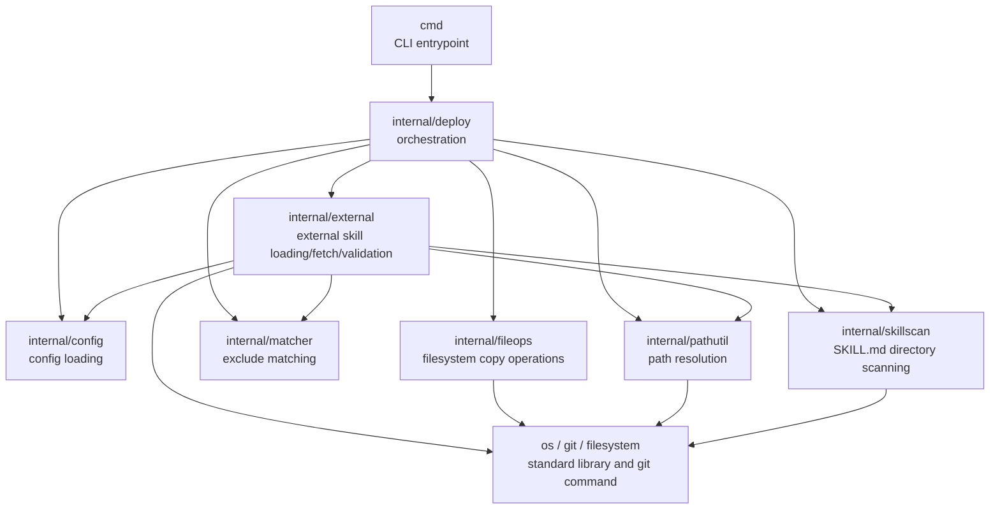

# deploy Design

`scripts/deploy` は、このリポジトリで管理している Codex / Claude 用の設定、agent、skill、prompt、rule をローカル環境へ配布するための小さな Go コマンドです。

利用者向けの使い方や JSON 設定の仕様は [README.md](./README.md) に置き、この文書では開発者が変更時に迷いやすい責務境界、依存方向、主要な処理フローを説明します。

## Goals

deploy の設計目標は、ファイルコピーという副作用を持つ処理を、設定解釈、パス解決、除外判定、外部 skill 取得、実ファイル操作に分けて保守しやすくすることです。

特に次の性質を重視します。

- `deploy.json` と `external-skills.json` の公開仕様を不用意に変えない。

- dry-run と実 deploy の表示・集計の意味を揃える。

- バックアップ、replace、exclude、flatten の挙動を局所的にテストできるようにする。

- 外部 skill 取得のネットワーク処理を Runner から差し替え可能にする。

## Package Map

```text
cmd
  CLI flags を読み、deploy.Runner を起動する薄い入口。

internal/deploy
  設定をもとに配布全体を orchestration する。
  backup / replace / copy / output summary の順序を管理する。

internal/config
  deploy.json の読み込みと最低限の validation を担当する。

internal/external
  external-skills.json、GitHub tree URL、外部 skill の取得・検証を担当する。

internal/fileops
  ファイルシステムへのコピー、ディレクトリ作成、tree copy、copy report を担当する。

internal/matcher
  exclude glob を root 相対パスへ適用する matcher を担当する。

internal/pathutil
  config path、source path、destination path、home expansion を担当する。

internal/skillscan
  SKILL.md を持つ skill directory の探索を担当する。
```

## Dependency Direction

依存方向は CLI 入口から下位の小さい責務へ流します。



`cmd` は `deploy` だけを知ります。`deploy` は orchestration 層として、`config`、`external`、`fileops`、`matcher`、`pathutil`、`skillscan` を組み合わせます。

`fileops`、`matcher`、`pathutil`、`skillscan` は deploy の業務フローを知らない小さな部品です。これらの package に Runner や CLI の都合を持ち込まないことを基本方針にします。

`external` は外部 skill 設定と取得を担当しますが、内部 skill との衝突検出のために `config`、`matcher`、`pathutil`、`skillscan` を使います。ここは deploy 設定と外部 skill 設定の接点なので、変更時は衝突検出のテストも合わせて確認します。

`config` と `matcher` は他の internal package に依存しません。`fileops`、`pathutil`、`skillscan` も deploy の上位フローへ依存しないため、単体テストで契約を固定しやすい構造です。

## Main Flow

`Runner.Run` は配布全体の流れだけを持ちます。

```text
1. -config path を絶対パスへ解決する
2. deploy.json を読み込む
3. 現在の working directory を取得する
4. backup root を決める
5. external-skills が指定されていれば取得・検証する
6. deploy.json の items を順番に配布する
7. external skill を destination ごとに配布する
```

`source` の相対パスは実行時の working directory 基準です。`destination` の相対パスは config file があるディレクトリ基準です。

この違いはユーザー向け仕様なので、`pathutil.ResolveSourcePath` と `pathutil.ResolveItemPath` の責務を混ぜないでください。

## Item Deployment Flow

通常 item の配布は、source の種類と `flatten` の有無で分岐します。

```text
regular file
  header
  backup destination if exists
  replace destination if requested
  copy file
  summary

directory
  header
  backup destination if exists
  replace destination if requested
  copy tree
  summary

directory + flatten
  header
  scan skill directories under source
  backup destination if exists
  replace destination if requested
  copy each skill directory to destination/<skill name>
  summary
```

flatten は `SKILL.md` を持つディレクトリを skill root とみなし、`destination/<ディレクトリ名>` に配置します。

同じ basename の skill が複数見つかった場合は上書きせずエラーにします。これは Codex / Claude の skill 配布先で名前衝突を隠さないための安全策です。

## External Skill Flow

外部 skill は `external.Load` で設定を読み込み、`ValidateConflicts` で次の衝突を事前に止めます。

- external skill 同士の `name` 重複

- internal skill と external skill の同名衝突

- external skill の `destination` 重複

fetch は `external.Fetcher` interface 経由です。通常実行では `GitFetcher` を使い、テストでは fake fetcher を注入します。

dry-run でも外部 skill の fetch と `SKILL.md` 検証は実行します。これは「コピーはしないが、実行すれば成功するか」は確認する、という仕様です。

## Skill Directory Scanning

`skillscan.WalkSkillDirs` は、direct child として regular file の `SKILL.md` を持つディレクトリだけを skill directory として通知します。

matcher は root 相対のディレクトリパスと `SKILL.md` パスに適用されます。除外されたディレクトリは descend しません。除外された `SKILL.md` や regular file ではない `SKILL.md` は skip として通知します。

この scanner は次の 2 箇所で共有します。

- flatten 配布でコピー対象の skill directory を探す。

- external skill の name が internal skill と衝突しないか確認する。

scanner は skill directory 配下も探索し続けます。nested skill を許可するか、skill root 検出後に prune するかは仕様判断が必要なので、現時点では既存挙動を優先しています。

## Exclude Matching

`matcher` は deploy 用の glob を正規表現へ変換し、root 相対パスに適用します。

`/` を含まない pattern は basename にも一致します。ディレクトリが exclude に一致した場合、その配下はまとめて skip します。

`matcher.CacheKeyPatterns` は、同じ exclude 意味を持つ pattern list を scan cache の key に使うための正規化関数です。現在の matcher は pattern 順序に意味を持たないため sort しています。将来、否定 pattern や順序依存の matcher を追加する場合は、この cache key の前提も見直してください。

## File Operations

`fileops` は Runner の概念を知りません。

`CopyTree` は copy root から destination root へ tree をコピーし、dry-run の場合は書き込まずに report だけ更新します。`TreeOptions.ExcludeRoot` は exclude 判定の基準、`CopyRoot` は destination 相対パスの基準です。flatten 配布ではこの 2 つが異なるため、混同しないでください。

`CopyDir` は backup 用です。`filepath.WalkDir` が parent directory を先に訪問する前提で、regular file は `CopyFileWithoutMkdir` を使います。これにより file ごとの余分な parent `MkdirAll` を避けます。

## Backup And Replace

deploy は destination が存在する場合、コピー前に backup を作ります。

backup は config file のあるディレクトリ配下の `.deploy-backups/<timestamp>/` に作成されます。backup path は destination の絶対パス構造を再現します。

`replace: true` の場合は backup 後に destination を削除してからコピーします。`replace: false` の場合は余分な destination file を残し、同名 file だけ上書きします。

backup と replace の順序は安全性に関わるため、変更する場合は `runner_test.go` の backup / replace 系テストを先に確認してください。

## Output And Report

Runner は item ごとに header、backup、replace、summary を出力します。

summary の `skipped` は、copy 中の exclude / unsupported entry だけでなく、flatten scan 時に除外された skill directory、除外された `SKILL.md`、regular file ではない `SKILL.md` も含みます。

現時点では「配布対象から外れたもの」の総数として扱っています。将来、skip の内訳をユーザーへ出したい場合は、`fileops.Report` と skill scan report を分ける設計にしてください。

## Testing Strategy

主なテスト責務は次の通りです。

- `deploy/runner_test.go`
  - CLI に近い統合挙動を確認する。
  - file / directory copy、dry-run、replace、backup、flatten、external skill の主要仕様を固定する。

- `external/external_test.go`
  - external skill と internal skill の衝突検出、exclude が衝突検出へ効くことを確認する。

- `fileops/fileops_test.go`
  - backup 用 directory copy の基本契約を確認する。

- `matcher/matcher_test.go`
  - cache key 用 pattern 正規化の前提を確認する。

- `skillscan/skillscan_test.go`
  - skill directory 検出、skip reason、visitor error の scanner 契約を確認する。

変更後は、少なくとも次を実行します。

```bash
go test ./...
```

必要に応じて、repo root から dry-run も確認します。

```bash
make deploy-dry-run
```

## Change Guidelines

公開仕様を変える変更では、README とこの DESIGN の両方を更新してください。

特に次の変更は影響範囲が広いため、統合テストを追加してから実装します。

- `source` / `destination` の path 解決基準の変更

- `exclude` pattern の意味の変更

- `flatten` の skill root 判定や nested skill の扱いの変更

- backup path や backup / replace の順序の変更

- dry-run で実行する検証内容の変更

戻す場合は、該当 package の変更だけでなく README / DESIGN の記述も一緒に戻してください。
